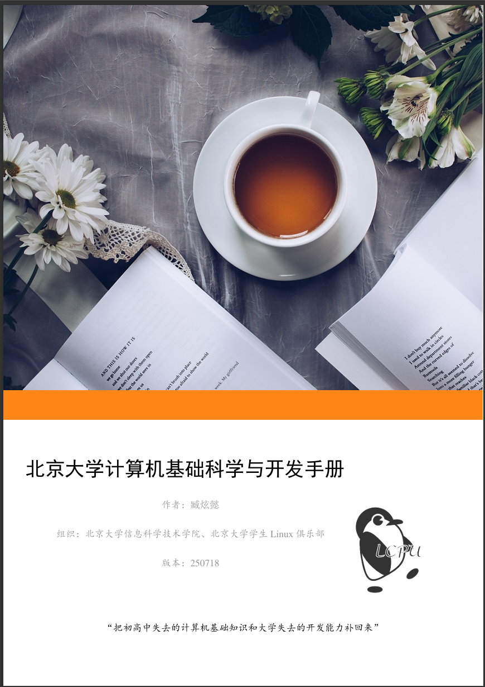
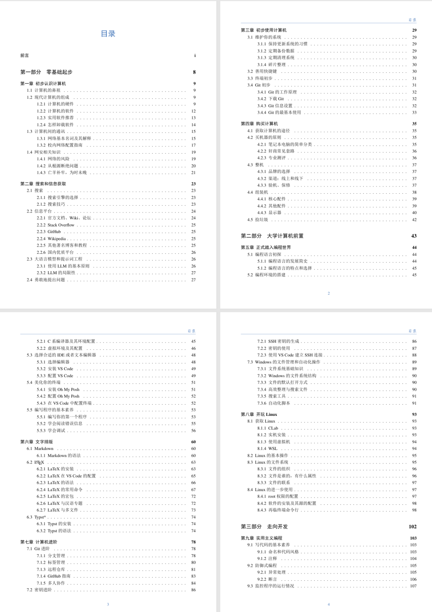

  

  

**前言**

  

对于相当一部分刚迈入大学生活的同学来说，第一次拥有属于自己的笔记本电脑，这无疑是令人兴奋的。然而，由于中学阶段相关课程的缺失，很多同学对于计算机的使用方式并不了解。而在大一开设的计算概论课程中，就要求部分同学从 Word，Excel，PowerPoint 都不一定熟练掌握的小白，转变为能够使用高级语言编写程序的学生，这无疑是一个巨大的挑战。

  

我们之前推出了LCPU Getting Started 系列教程，反响良好，但 Getting Started 主要是课程讲义，专注于某些话题，而非试图系统性涵盖所有知识，也不是为了中学与大学的计算机知识衔接而设计。

  

因此，社团骨干臧炫懿同学撰写了这本《北京大学计算机基础科学与开发手册》，试图为所有同学提供一本计算机的入门参考手册，补足之前没有涉及到的知识，为之后的学习铺好基础。手册已经在 GitHub 持续**开源、高强度**更新了一个月，今天正式公开推送，希望帮到更多同学。这本手册目前有167页内容，信息量满满，并会持续更新。

  

  

**01**

📖 **手册定位**

**一句话总结**：把初高中缺失的计算机知识 + 大学丢失的开发能力，一口气补回来。

**目标读者**：

● 完全零基础的计算机新人  

● 学过一些课程，却依旧不熟悉动手实操的同学  

● 想自己装机/配环境/写代码/调 bug，却被各种教程劝退的任何人

● 希望快速掌握 LaTeX、Python等计算机工具的文科同学们  

● 以及更多想了解计算机知识的同学们

**02**

🎯 **内容速览**

**Part 1 零基础起步****：** 计算机组成、买机避坑、网络配置、Git 入门……  

**Part 2 大学前置** ：VS Code + Linux 一条龙配置；MarkDown/LaTeX/Typst学术排版……  

**Part 3 走向开发****：** 调试、测试、CI/CD、防御式编程、微服务架构等实战套路。（持续高强度更新中！）  

**附录：** Mini-ICS、C++/Python迅速入门、文科生三件套（Pandas/Matplotlib/jieba）速查表。

目录节选

  

**03**

**💡 使用技巧（亲测有效）**

**1\. 先翻目录：** 按需跳读，不用通篇啃。  

**2\. 跟着敲：** 每段代码都可复制粘贴，但更推荐手敲，踩坑即成长。  

**3\. 提 Issue：** 遇到问题直接 GitHub 提 Issue，作者帮忙解决。

**4\. 一键更新：** git pull +overleaf编译就能拿到最新更新，不用等作者一周一更的release，持续追更无压力。 

**04**

**📌 开源地址**

GitHub：**ZangXuanyi/getting-started-handout**  ，可以在release下载到最新版

  

欢迎 Star、Fork、PR，所有贡献者都会进入致谢名单！

  

点击“阅读原文”，或在微信公众号留言“手册“也可获取PDF下载地址

**最后一句：**  

如果你觉得“计算机应该服务于人，而不是折磨人”，这本手册就是为你写的。  

祝各位玩得开心，写得顺手，跑得飞快！

  

【小编注：欢迎大家多多star仓库，提交PR，鼓励爆肝的作者！】
