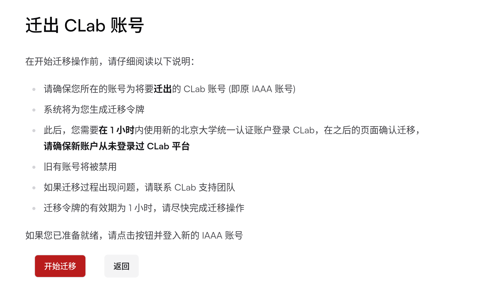

为更好的服务毕业同学使用 CLab ，毕业生迁移功能现已上线，用户可将 CLab 账号从原有已毕业的统一认证账号迁移至新的统一认证账号。

若要迁移，请确保：

1. 原有的统一认证账号已在 CLab 上注册登录。如从未使用过 CLab ，使用新的统一认证账号登入即可；

2. 新的统一认证账号状态为“在校”； 

3. 新的统一认证账号从未登入过 CLab 。如已登录过 CLab ，请使用新统一认证账号的学号邮箱发送邮件至[linuxclub@pku.edu.cn](mailto:linuxclub@pku.edu.cn)，主题为： `[CLab] 确认删除本邮箱关联的 CLab 账号` 。

## 操作步骤

1. 使用原有账号[登入 CLab](https://clab.pku.edu.cn/auth/login)；

2. 此时应跳转至用户迁移界面，阅读并确认网页信息，点击**开始迁移**；

3. 在新的登入页面登入新的统一认证账号；

4. 核对新账号信息，确认无误后点击**确认迁移**。

**请在 1 小时内完成以上操作流程**，如果遇任何问题，请联络[linuxclub@pku.edu.cn](mailto:linuxclub@pku.edu.cn)。
