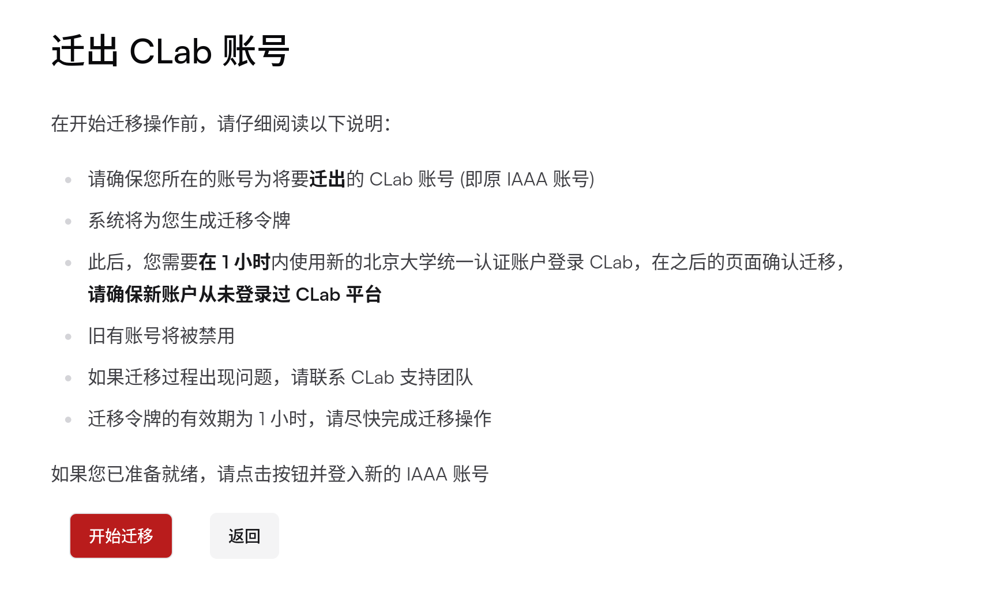

为更好的服务毕业同学使用 CLab ，毕业生账号迁移和数据取回功能现已上线，用户可将 CLab 账号从原有已毕业的 IAAA 账号迁移至新的 IAAA 账号，旧账号内虚拟机的数据将全部转移至新账号；或者取回 CLab 虚拟机中的数据。

若要迁移，请确保：

1. 原有的 IAAA 账号已在 CLab 上注册登录。如从未使用过 CLab ，使用新的 IAAA 账号登入即可；

2. 新的 IAAA 账号状态为“在校”； 

3. 新的 IAAA 未登录过 CLab 。如已登录过 CLab ，请使用新学号的 pku 邮箱发送邮件至 linuxclub@pku.edu.cn ，主题为： `[CLab] 确认删除本邮箱关联的 CLab 账号` 。

如您从北京大学毕业，我们也提供账号数据取回服务，请见“数据取回操作步骤”。

## 迁移操作步骤

1. 使用原有账号登入 CLab，网址：https://clab.pku.edu.cn/auth/login

2. 此时应跳转至用户迁移界面，阅读并确认网页信息，点击**开始迁移**；

3. 在新的登入页面登入新的统一认证账号；

4. 核对新账号信息，确认无误后点击**确认迁移**。

**请在 1 小时内完成以上操作流程**，如果遇任何问题，请联络linuxclub@pku.edu.cn。

## 数据取回操作步骤

1. 请使用学号邮箱发送邮件至 linuxclub@pku.edu.cn，主题为： `[CLab] 取回已毕业账号文件`；

2. 取回包括A和B两种形式。A. 虚拟机镜像取回，我们将把您的虚拟机完整镜像上传至北大网盘，给您发送链接。B. 指定目录取回，我们将从您的虚拟机中提取指定目录的数据，打成压缩包后上传，给您发送链接；

3. 请在邮件中包括以下信息：姓名、学号、联系电话、联系邮箱、取回形式。如果是取回形式B，请针对每个虚拟机，给出需要取回的路径。默认将取回虚拟机的/home目录；

4. 如您的学号邮箱已失效，提供其他能体现学号、证明是本人的材料即可，如校园卡+毕业证书、校园卡+身份证等组合。有任何问题，可以邮件联系我们。
