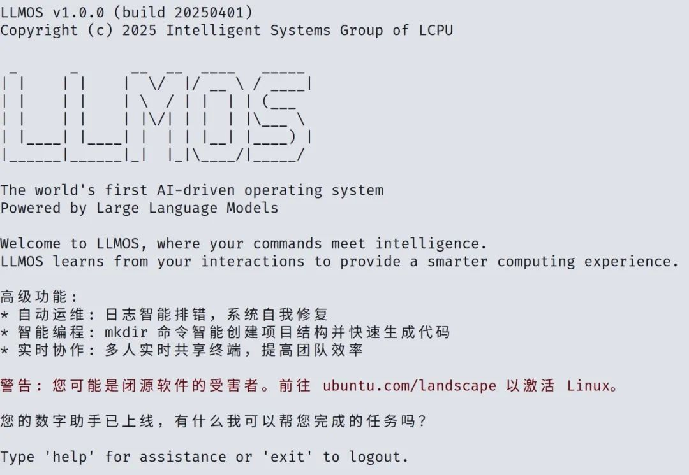

在这个春暖花开，万物复苏的季节里，我们怀着激动的心情宣布: 由 LCPU 开发的 LLMOS，. Fully powered by Large Language Models, 正式上线 CLab 云计算平台 🐧 ！

LLMOS 深度融合了 CLab 平台的基础算力与来自 LCPU AP 成员的专业 Linux 知识，致力于为你打造独一无二的专属 Linux 使用体验。



## 核心亮点

### No More **_Linux Update_**

智能识别 CPU 占用率，在不忙的时候让电脑持续发光发热，及时打上最新的 Out of Tree 补丁让你体验到最新的 Linux 技术；同时，AI 会智能判断用户交互，避免在工作时间弹出恼人的 Linux Update。


### 编译加速，为你的程序插上 AI 的翅膀

```
./configure -prefix=/var/www/html --sbin-path=/usr/sbin/nginx --conf-path=/etc/nginx/nginx.conf --http-log-path=/var/log/nginx/access.log --error-log-path=/var/log/nginx/error.log --with-pcre  --lock-path=/var/lock/nginx.lock --pid-path=/var/run/nginx.pid --with-http_ssl_module --with-http_image_filter_module=dynamic --modules-path=/etc/nginx/modules --with-http_v2_module --with-stream=dynamic --with-http_addition_module --with-http_mp4_module --with-mail --with-mail_ssl_module --with-openssl=/usr/include/openssl/

make -f objs/Makefile
make[1]: Entering directory '/root/nginx'
cd /usr/include/openssl/ \
&& if [ -f Makefile ]; then make clean; fi \
&& ./config --prefix=/usr/include/openssl/.openssl no-shared no-threads \
&& make \
&& make install_sw LIBDIR=lib
/bin/sh: 3: ./config: not found
make[1]: *** [objs/Makefile:1705: /usr/include/openssl/.openssl/include/openssl/ssl.h] Error 127
make[1]: Leaving directory '/root/nginx'
make: *** [Makefile:10: build] Error 2
```

有了 LLMOS，你将不会不会再遇到恼人的 `failed after 4 months 1 days`！AI 将自动为你安装缺失依赖，选择最合适的编译与优化参数，如果有缺失依赖还将尝试自动生成源码补齐；更贴心的是，LLMOS 还会将长达`998244353`行的编译输出翻译为人话，让你的龙芯打包变为一块蛋糕！


### 实时 Shell 协作，真正的“云计算”

LaTeX 可以在线协作，游戏可以一起开黑，Shell 怎么能不上云？LLMOS 不仅有实时 AI 助手随时为你排忧解难，还可以随时连线你的好友帮你运维。命令行键入 `@` 后选择好友，LLMOS 将即刻通过脑机接口“上线”你的好友，通过实时协作来达到 `1+1>2` 的效率体验。


### `mkdir-rs`，不仅仅是锈化

当下最流行的技术是什么？锈化、云原生……当然是接入 AI 啦！洗碗机可以有 AI，`mkdir` 当然也不能落后！`mkdir-rs` 不仅由语言神重写，还将在创建文件夹的同时帮你“自动充填文件夹”！可以试试 `mkdir hello-world` 哦！

## 体验方法

只要你是 CLab 用户，现在就可以升级体验 LLMOS 啦！登入你的主机并键入 `wget -qO- llmos.lcpu.dev | bash && source .llmos/bin/activate && ./llmos` 或 `curl -L llmos.lcpu.dev | bash && source .llmos/bin/activate && ./llmos` 即可体验！

（注意：连接至 LLMOS 后，你将有 90 天的评估时间，超过评估时间后将被强制登出。）

## 技术细节

- 支持架构: `x86_64`, `arm`, `Loongarch`, `LCPU 9¾`
- 最低配置: 1 x Potato + 4 x Kittens with **TPM 2.1 (Teapot Monitoring Module)**
- Kernel:

## 用户评价

- “自从用了LLMOS，我的猫学会了写内核模块！”——Linus Catvalds
- “98%的用户表示编译失败后更快乐了，因为他们终于有时间去约会了！”
