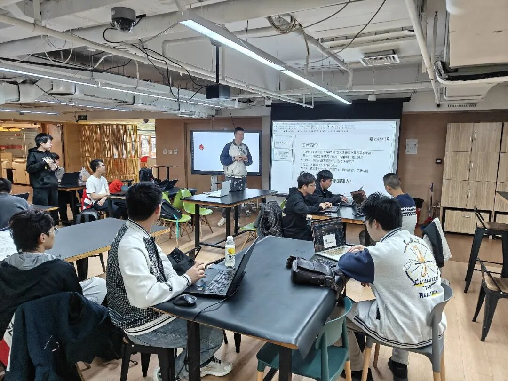
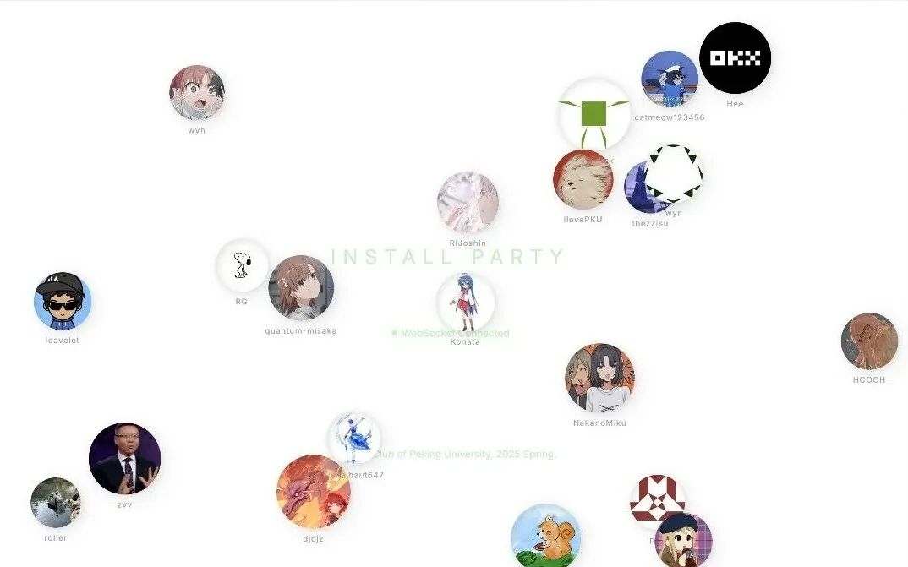
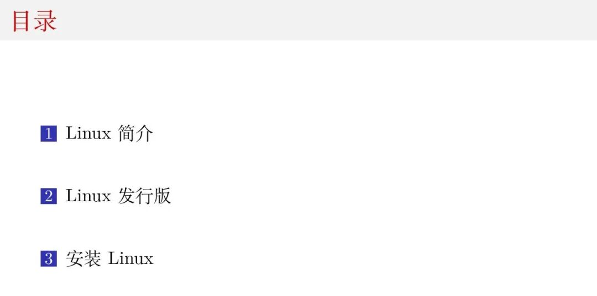

作为一名 LCPUer ，你是否想要了解 Linux 俱乐部的日常活动与开发项目，是否期待在你的 Intel / AMD / 树莓派 / 龙芯 / ... 设备上运行装机数量最多的 Linux 操作系统？北京大学学生 Linux 俱乐部将于本周六上午在极客实验室举办迎新会，为大家介绍本学期的项目计划与活动安排，并分享 Linux 发行版知识与使用经验。骨干成员还将手把手带领你在自己的设备上安装 Linux 操作系统，以便成为一名合格的小企鹅！

- 时间: 2025年9月27日(星期六) **上午** 10:30-12:30 (CST)
- 地点: 北京大学二教地下极客实验室(公众号后台回复**极客实验室**获取路线图)
- 线上参与: 活动开始前将在  https://old.lcpu.dev/inpart25f  及群内更新直播地址及现场演示文稿

## 现场活动

### 1Git 打卡

在本次迎新会现场，我们为大家准备了 Git 打卡活动，欢迎大家向 https://github.com/lcpu-club/2025-fall-registration/ 仓库提交自己的头像及个人信息，当提交被合并后，现场大屏就会出现你的头像啦！欢迎大家从各自的社交主页中发现有趣的灵魂，也欢迎大家在线下活动中多多交流，结识志同道合的小伙伴。

完成打卡后，现场还有贴纸、小企鹅钥匙扣、LCPU 键帽等精美周边等你领取！

> 如果你还不了解如何使用 git ，欢迎参阅 **Getting Started 系列课程**讲义及百团现场发放的**计算机基础能力手册**！

### 2迎新会

或许你第一次听说 Linux 俱乐部，或许你已经用过了许多俱乐部项目，也可能你想要来现场与骨干成员深入交流。在迎新会的前半部分，骨干成员将首先向大家介绍 Linux 俱乐部本学期的项目开发计划与规划的日常活动。欢迎大家畅所欲言，帮助我们更好地开发项目与组织活动，也欢迎大家积极参与到社团项目的建设当中。如果你有着全新的项目灵感希望实施，不妨在这里和大家分享，我们会尽力帮助大家实现自己的项目灵感！

> 可在本文末尾查看迎新会上将会介绍的项目列表。
>
> 迎新会结束后，骨干将组织工作交流会，欢迎感兴趣的同学直接与对应项目的负责人联系

### 3Install Party

本次 Install Party 将由 **Linux 俱乐部学习部部长、北京大学计算机基础能力手册作者臧炫懿同学**来为大家简要介绍 Linux 发行版并带领大家在自己的设备上安装 Linux 操作系统。

由于时间关系，社团无法在短时间内面面俱到地讲述 Linux 使用，推荐感兴趣的同学关注 Linux 俱乐部 Getting Started 系列课程了解更多 Linux 知识。

为了便于 Linux 操作系统的安装，大家可以提前准备:

- **虚拟机安装**: 可提前在自己的设备上安装 Virtual Box、Parallels Desktop 等虚拟化软件，或登录 CLab 创建虚拟机。
- **双系统安装**: 我们推荐使用第二块硬盘以安装 Linux 操作系统。如要通过硬盘分区安装，请提前关闭 BitLocker/FileVault 等硬盘加密服务
- **裸机安装**: 请务必提前对设备数据做好备份，建议没有 Linux 使用经验的同学先在非主力设备上体验 Linux。

我们将在现场提供 Linux 安装 U 盘，同时骨干将在现场为你提供手把手指导！

希望能与大家度过一个美好且有意义的下午！

## Linux 俱乐部部门及项目一览

- 技术部

  技术部拥有丰富的计算资源，开发并维护了多个项目，涉及前后端、系统、网络、虚拟化、 Linux 内核等由浅入深多种领域知识，每个项目都由学生导师指导，不仅可以在工程实践中收获经验、精进自己的代码知识，还可以为北大教学科研做出贡献。

- CLab 云计算平台

  CLab 是全国首个由高校社团自主打造的云计算平台，为北大师生提供免费的 Linux 开发环境与云端算力，目前已经与校内多门课程合作，助力教学研究发展。本学期，第二代 CLab 云计算平台将继续推进，期望能对标阿里云等商业云服务提供商，实现云GPU及RDMA等功能，并进一步优化用户体验。

- 硬件特别兴趣小组

  我们与 AMD 合作，希望能够在 FPGA 硬件上进行一些应用方面的尝试。本学期计划将实现 HDMI 采集卡。

- Agent 兴趣小组

  探索大模型与 Agent 应用开发，目前的方向有: 结合测评数据进行旅行路线规划；微信群聊记录总结。

- Arch Linux for Loong64

  Arch Linux for Loong64 是由社团维护的Linux发行版移植项目。该项目不仅为国产的龙架构持续维护了高质量的Arch Linux发行版，还以发行版维护为主线，推动整个上游的龙架构支持生态的完善。项目具有详尽丰富的文档和参与指引，为成员成长提升创造了优秀条件，旨在培养更多能够为社区生态作出贡献的人才，并逐步推动Arch Linux上游官方接受龙架构支持。

- PKUInfo 校内资讯汇总

  PKUInfo 是由社团开发并维护的校内资讯大模型自动汇总平台。本学期我们期望能够重启平台的开发，将校内资讯接入 MCP 服务器，同时开发 Agent 服务，成为大家全方位的校园生活助手。

- PKUTeX 论文协作平台

  PKUTeX 是 LCPU 基于 Overleaf 开源项目打造的论文在线协作平台。本学期我们期望能够完善在 OSPP 开源之夏项目中实现的大模型补全功能，并实现 GitBridge 等功能。

- 学习部

  学习部主要负责帮助来自不同院系、不同背景的同学快速掌握计算机使用技巧，了解计算机学习思路，并为有兴趣的同学提供了进阶学习小组，共同学习前沿技术。

- Getting Started 与计算机基础能力手册

  Getting Started 项目是由社团骨干成员开发设计，对标 MIT Missing Semester 计划，补充校内课程体系缺失的计算机基础能力培训，面向全校同学，普及计算机知识，帮助大家更好的利用计算机完成日常工作。

  计算机基础能力手册是由社团骨干臧炫懿同学在暑假编撰而成的一本功能详尽、难度梯度得当的计算机知识参考手册，目的是帮助刚刚踏入校园的同学掌握基础的计算机能力。

  本学期，学习部预计将整理两份课程的内容，形成统一的讲义，并以 PDF / Web 一式两份发布，便于大家学习更新。

  同时，我们还期望能够继续线下的 Getting Started 课程，在学期初举办讲座帮助大家配好计算机环境，高效开启大学生活。

- 内核与虚拟化学习小组

  本小组预计于本学期开启，将共同学习 Linux 内核、虚拟化及相关知识，以便帮助下一代 CLab 项目实现云 RDMA、硬件虚拟化等高级特性。

- 运营部 & 活动部

  运营部负责统筹运营社团的日常工作，包括开展纳新、财务报销、周边设计制作、社衫征订与企业关系合作；活动部负责组织线下沙龙讲座、团建、企业参访等活动。

- JetBrains 技术交流开放日专题讲座
- AI相关讲座
- Mini Getting Started沙龙

- 沙龙活动

  我们将邀请社团骨干及专家来为大家进行前沿技术与经验分享，并鼓励大家相互交流，建立联系，以下是本学期预计开展的机场讲座：

- 影像视频小组

  影像视频小组负责在活动现场拍照、搭建直播/录制系统。

- 2025-2026秋季社衫征订
- GeekGame 网络安全比赛

文案: 方尤乐 霍子晗

排版: 霍子晗

问卷制作: 任宣霖

图片提供: 霍子晗 戴嘉震 臧炫懿

审核: 李思润 黄熙鸣

本次活动的周边及餐食由宽德投资赞助，感谢宽德投资对 Linux 俱乐部的长期支持。

