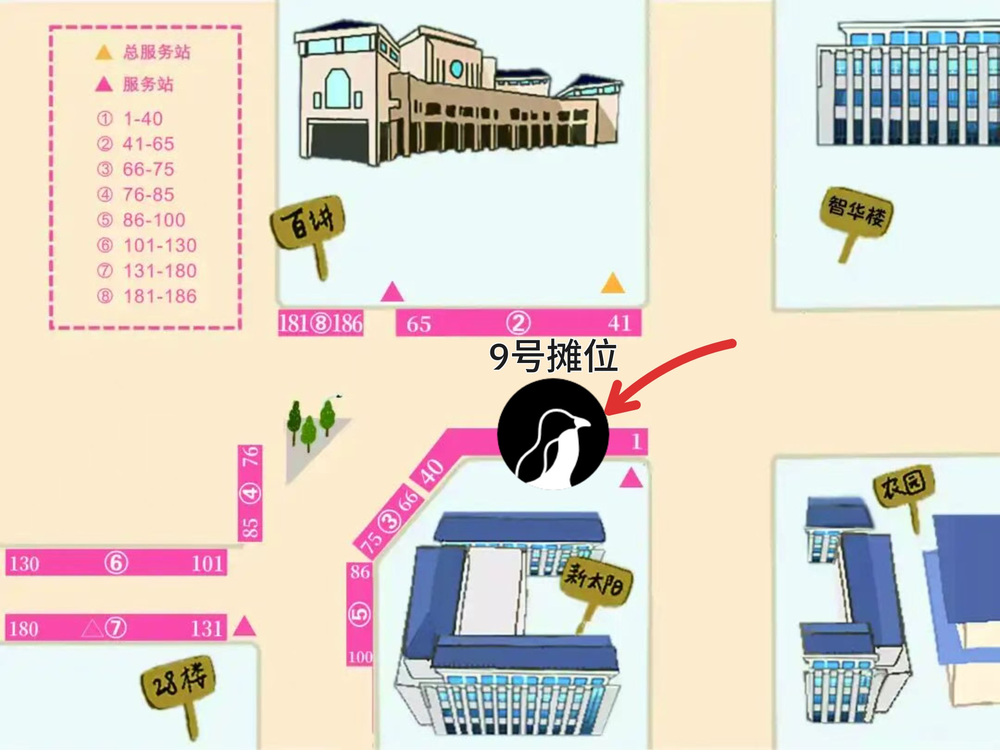
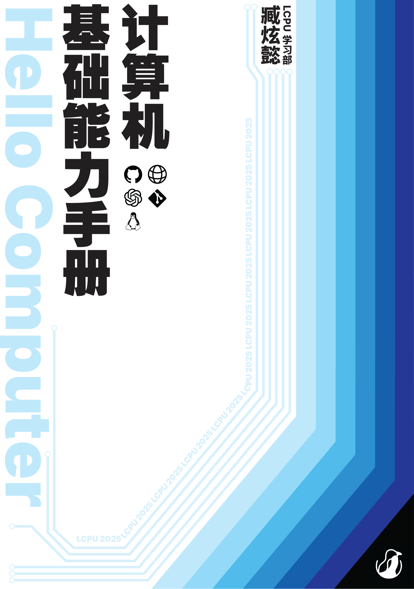

# 

---
title: 百团大战现场游戏&展示&周边等你来！
time: 2025-09-18
tags: ['招新']
---

地点示意图

*   **地点**: 百讲南侧与新太阳北侧 **9 号摊位**
    
    **时间**: 2025年9月19日-20日(周五-周六) 10:00-17:00
    

## $ whoami

北京大学学生 Linux 俱乐部 ( Linux Club of Peking University, **LCPU** ) 成立于 2003 年，是北京大学最活跃的学术科创类社团之一，致力于学习和研究 Linux 操作系统及其他开源软硬件技术。

我们拥有丰富的计算资源，开发并维护了 **CLab**、**PKUTeX**、**PKUGit** 等多个服务全校师生的项目；组织开展了 Getting Started 等系列计算机基础学习课程，帮助来自不同院系、不同背景的同学快速掌握计算机使用技巧；还有丰富多彩的技术沙龙，邀请开源社区、互联网企业的技术大佬前来分享；在假期，我们还组织骨干团队前往**上海交通大学**、**南京大学**等高校交流分享。

总而言之，LCPU 是一个充满温暖、充满想象的大家庭。无论你来自哪里，只要你对技术感兴趣，我们都欢迎你加入 LCPU ，在未知的挑战中收获知识与热爱！

## 现场活动

作为学术科创类社团，除了收获知识、创造价值，最重要的当然是收获兴趣与快乐啦！我们在百团现场准备了超多好玩的活动，让你在游戏中学习知识；社团骨干也将在现场实时解答，欢迎各位同学前来交流经验。还有许多精美社团周边等你来赢取哦~

  

### 趣味知识竞答

想要检测自己的计算机水平？欢迎挑战 LCPU 趣味知识竞答！这里不仅有多套题目任你挑选，涵盖Linux知识、计算机趣味历史、编程语言等多个方向，还支持多人组队抢答，紧张刺激又不失有趣！

每场竞答共五道题，难度逐步升级，全部答对即可赢取精美社团周边奖品。现场更有积分榜实时累计，欢迎多次挑战持续霸榜。快点带上你的好朋友，一起来参与LCPU知识竞答，挑战自我，收获乐趣，把奖品和荣誉一同带回宿舍吧！

Tip: 如果觉得题目有些难度，可以参考由 LCPU 学生部臧炫懿同学编撰的[计算机基础能力手册](https://mp.weixin.qq.com/s/8_ngvXJ8xJfzZtSmGJ1hhA)，参与活动将有机会领取纸质版手册，欢迎在复习后再来挑战哦！

在9月20日(周六)中午11-12点，答题形式将转为擂台赛**一战到底**。坚持到最后即可赢取计算机基础能力手册(精装版)及其它奖品！

### CLab 云计算平台线下实机展示

或许你听说/使用过 [CLab 云计算平台](https://mp.weixin.qq.com/s/MiaDPawZpCdxf4D0Q7A79Q)，并且使用 SSH 连接到了我们的云平台，但是“云”究竟是怎样运行的呢？本次百团大战 LCPU 将带来 CLab 实机服务器线下展示，让你一探究竟！

不同于家用台式机，服务器在外观与功能上都大有不同。LCPU 技术部骨干将在现场讲解服务器的基本构成与工作形态，解答你关于硬件和运维的所有好奇。

服务器还将不定时点亮，欢迎你带着你的运维知识与有趣应用来到 CLab “本地”计算平台实践！

### Git 打卡注册

Git 是每名开发者的必备工具，而借助 Git 还可以完成超乎你想象的各种事情……比如线下打卡。本次百团，我们将用现场互动显示屏展示参与百团同学的社交卡片，通过向 [https://github.com/lcpu-club/2025-fall-registration](https://github.com/lcpu-club/2025-fall-registration) 完成一次“开源贡献”即可让你头像上屏！

如果你希望参与到好玩有趣的线下活动，也可以直接在百团时间内向仓库打卡，同样会将你的头像呈现在现场屏幕！

（根据现场打卡人数，较先打卡的卡片可能会被标记为不活跃而不再显示）

### LLMOS 现场操作体验

[~~The World's First AI-driven Operating System, Made by LCPU!~~](/announcements/grand-opening-of-llmos/)

虽然是一个愚人节项目，但我们欣喜地发现，~这一灵感被各大公司借鉴~。现如今，我们已经有了~类似~LLMOS 的 Gemini CLI 等一众开源应用可以让我们借助大语言模型的力量更好的成为 Linux Power User。我们将在现场展示 LLMOS 与 Gemini CLI，领略大语言模型的应用。

## 本学期项目&活动预告

### 下一代 CLab 云计算平台开发工作

CLab 是 LCPU 打造的开放云计算平台项目，深度适配校内课程，为同学们提供了开箱即用的编程环境，方便大家快速上手开始学习。目前已经为 15+ 课程提供了教学环境支持，服务全校43个单位超4000名用户，为同学们减少了不必要的学习负担。

本学期，我们将继续 CLab 平台的开发，预期对标商业云服务提供商，实现云 GPU 及 RDMA 等功能。

### 沙龙活动

我们将于近期举办一系列沙龙活动，介绍校园网使用技巧与寝室私有网络搭建指南；同时，还将在近期举办编程语言沙龙，邀请校内专家探讨不同编程语言的内部工作原理，与同学们面对面交流，分享前沿技术！

### Mini Getting Started 讲座

初入校园的你或许还在为环境配置而头疼。“工欲善其事，必先利其器”。Mini Getting Started 系列沙龙将手把手教你配置 IDE、搭建开发环境，教会大家如何以更高效地方式利用你的电脑，帮助你专注于代码本身。

### PKUTeX 论文协作平台

这个暑假，PKUTeX 参与了 OSPP 开源之夏项目，初步实现了大语言模型补全能力。本学期，我们将继续开发这一项目，将前端对齐上游项目进度，完善大语言模型补全与前端界面。

## 加入我们

感觉现场的活动意犹未尽？想要和更多技术同好交流？或是亲手打造服务全校的酷炫项目？欢迎你成为 LCPU 大家庭的一员！

如果你对我们的活动感兴趣，想第一时间获取社团讲座、技术沙龙和日常活动的最新信息，欢迎关注本公众号获取活动资讯；或在百团大战现场参加迎新活动，骨干将拉你进入 LCPU 讨论群。

如果你希望能够参与项目的设计开发、组织沙龙等线下活动，希望与一群志同道合的伙伴们共同学习成长，我们诚挚地邀请你报名加入 LCPU 的骨干团队。

我们欢迎任何背景、任何技术水平的同学。无论你是经验丰富的开发者，还是充满好奇心的技术萌新，只要你怀有学习的热情和探索的勇气，LCPU 都将是你施展才华、快速成长的舞台。

欢迎点击下方推送了解骨干招新详情，我们期待你的加入！

