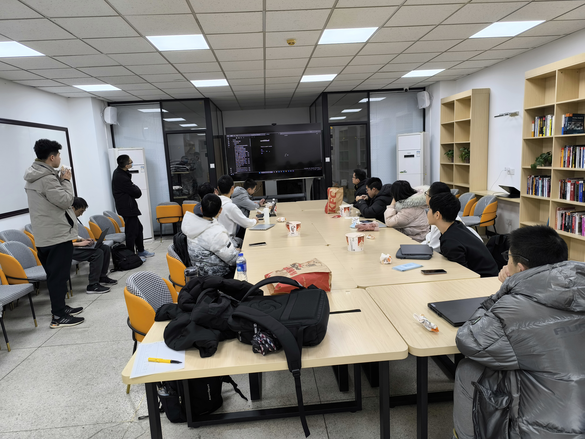

  

  

如果你热爱计算机，乐于分享，希望将你的奇思妙想变为现实……

那么你一定不要错过**北京大学学生 Linux 俱乐部**！

无论你是否来自信科，无论你的代码基础如何，在这里，你能够：

*   在实践中检验开发水平，用自己的代码服务北大师生
    
*   参与**课程创作**，用自己的热爱帮助更多志同道合的伙伴
    
*   组织[举办前沿技术沙龙](https://mp.weixin.qq.com/s?__biz=MzkxMTIyODMwOQ==&mid=2247483903&idx=1&sn=6f9d948473bf25421c2ea409bdefc332&sharer_shareinfo=1f90492103e54de0dfb178cdb96351f1&sharer_shareinfo_first=1f90492103e54de0dfb178cdb96351f1&poc_token=HDbNwmij4eyD4Zva8HrkRbSQ-_3YxZzBI2IQoC6X&scene=21#wechat_redirect)，与技术大佬谈笑风生
    
*   打磨你的团队管理经验，参与运营[北大品牌社团](/news/lcpu-brand-club/)
    
*   与头部企业合作，助力社员、企业共同发展
    

以及最最重要的……收获一群热爱技术、互帮互助的好朋友！

## $ whoami

北京大学学生 Linux 俱乐部 ( Linux Club of Peking University, **LCPU** ) 成立于 2003 年，是北京大学最活跃的学术科创类社团之一，致力于学习和研究 Linux 操作系统、开源软硬件技术以及其他有趣的技术问题。

我们拥有丰富的计算资源，开发并维护了多个项目，涉及前后端、系统、网络、虚拟化、Linux内核等由浅入深多种领域知识，每个项目都由学生导师指导，不仅可以在工程实践中收获经验、精进自己的代码知识，还可以为北大教学科研做出贡献。

我们还开办了许多学习课程，帮助来自不同院系、不同背景的同学快速掌握计算机使用技巧，了解计算机学习思路，并为有兴趣的同学提供了进阶学习小组，共同学习前沿技术。

同时，这里还有丰富多彩的技术沙龙，不仅有来自开源社区、企业的技术大佬分享，更有来自同学接地气的经验分享，帮助新生老生在校园收获更便利数字生活。在社团交流群中，每天都会有几千条技术讨论，相信你的到来会让社团内的灵感碰撞更加丰富充实。

总而言之，LCPU是一个充满温暖、充满想象的大家庭。无论你来自哪里，只要你对技术感兴趣，我们都欢迎你加入LCPU，在未知的挑战中收获知识与热爱！

( 欢迎填写问卷报名 https://f.kdocs.cn/g/lfErHbn3 )

## 组织架构

### 技术部

作为学术科创类社团的门面担当，我们开发并维护了 **[CLab 云计算平台](https://mp.weixin.qq.com/s?__biz=Mzk0OTY1ODc0Nw==&mid=2247484384&idx=1&sn=5169d6f03b7431804145786a6de678ec&scene=21#wechat_redirect)**、**[PKUInfo 校内资讯汇总](https://mp.weixin.qq.com/s?__biz=MzkxMTIyODMwOQ==&mid=2247483799&idx=1&sn=09be959b752c015148532087c0a7c2df&sharer_shareinfo=da5377450d76f9c236422c0ac42d482d&sharer_shareinfo_first=da5377450d76f9c236422c0ac42d482d&poc_token=HLDNwmijkPk1ikIewpL-loYPg-9dbOTba92I3vAA&scene=21#wechat_redirect)**，运营了 **PKUTeX 论文写作平台**、**PKUGit 代码托管及 CI 平台**、**北京大学开源镜像站**等多个助力师生科研创新的工具；同时，我们还积极投身国内外开源社区，助力国产软硬件发展，推动并维护 **Arch Linux 发行版在龙芯平台上的移植**。社团大部分项目均开源在 https://github.com/lcpu-club ，希望能与全球开源社区分享成果。

与此同时，我们与北京大学未名超算队、北京大学PKUCC战队（网络安全）开展深入交流活动，下设超算兴趣组与网安兴趣组，通过社团项目帮助同学掌握超算及网络安全的相关知识点，培养专业领域兴趣，最终加入未名超算队/PKUCC战队参与比赛，为校争光。

我们希望能够为大家提供一个实践平台，作为课本知识的补充，帮助大家检验自己的代码开发能力，同时也帮助来自其他院系的同学通过简单的项目入手学习代码知识。如果你有着不错的技术基础，希望能够参与到社团项目的开发，通过实战检验自己的技术水平；对新架构、新硬件感兴趣；或是希望能够在技术部各小组中学习新的知识，探索自己感兴趣的领域，技术部将是你的不二之选！

#### 成员风采

* **霍子晗**
  *   23级外国语学院
  *   Linux 俱乐部社长
  *   PKUTeX 项目负责人
  *   CLab 云计算平台第二代系统组组长
  *   CLab 云计算平台运维
  *   兴趣爱好: 猫、Linux、系统运维、开源软件

*   **黄熙鸣**
    *   24级工学院
    *   Linux 俱乐部理事长
    *   下一代北京大学开源软件镜像站负责人
    *   CLab 云计算平台运维
    *   兴趣爱好: 超算、加密货币、摩托车

*   **戴嘉震**
    *   24级信科
    *   Linux 俱乐部团支书
    *   LCPU Home 社团主页项目负责人及开发者
    *   CLab 云计算平台第二代前端组组长及主要开发者
    *   **兴趣爱好**: 设计、前端、美食

### 学习部

我们编撰了 **Getting Started 计算机入门系列课程**与**北京大学计算机基础能力手册**；开设了 Rust 、内核与虚拟化等学习小组。

在本学年，我们会继续维护基础计算机系列讲义并开设线下课程，帮助更多同学高效使用计算机，了解计算机学习路径；同时根据同学们的兴趣与社团发展需要组织学习小组与讲座活动。

如果你有扎实的计算机基础、出色的表达能力、妙笔生花的写作水平、课程设计经验、LaTeX 排版 / PPT 制作功底……又或者，只是对以上课程感兴趣，希望能够为此出一份力，欢迎加入 LCPU 学习部！

  

  

  

  
  

#### 成员风采

*   臧炫懿
    *   23级信科
    *   学习部部长
    *   北京大学计算机基础能力手册作者
    *   在MoriZero参与Milthm（梦见霖音）的开发工作
    *   曾在Ndemic Creations中国玩家社区做项目维护
    *   在北京大学-华祥智能情感交互联合实验室作科研实习
    *   兴趣爱好: 桌游和类似桌游的电子游戏，写东西，睡觉，以及我是大笨蛋
  

### 活动部

我们负责开展每学期一度的迎新活动 [Install Party](/news/2025-spring-installparty/)、曾组织了有多个开源社区参与的[发行版之夜](https://mp.weixin.qq.com/s?__biz=MzkxMTIyODMwOQ==&mid=2247483903&idx=1&sn=6f9d948473bf25421c2ea409bdefc332&sharer_shareinfo=1f90492103e54de0dfb178cdb96351f1&sharer_shareinfo_first=1f90492103e54de0dfb178cdb96351f1&poc_token=HDbNwmij4eyD4Zva8HrkRbSQ-_3YxZzBI2IQoC6X&scene=21#wechat_redirect)等沙龙讲座活动及由学生骨干进行分享的**寝室网络环境和设备**等沙龙；同时，我们还负责组织 **HPCGame** 系列赛事。

百团大战迎新后，我们即将开展本学期的 **Install Party**，带领新同学~安装 Linux 操作系统~认识俱乐部、了解社团活动与项目；近期预计还将举行校园网高效使用指南沙龙活动，帮助新生快速布置寝室网络环境，助力大家能在北京大学享受流畅的校园网络体验。我们还将结合社团同学兴趣及技术潮流，邀请外部讲者及技术骨干做分享。

如果你有活动/赛事举办经验、熟悉海报制作、有着广泛的人脉、充满有趣的活动灵感，或者你是 Linux 爱好者，希望在 Install Party 为你喜爱的发行版站台……又或是希望能为社团活动出一份力， LCPU 活动部是你的不二之选！

  

### 运营部

我们负责筹备**百团大战**活动设计、参与校园文化节、管理社团资金，完成财务报销流程；定期举行社团内部团建、整理社团动态并撰写推送，还负责**设计社团各项周边**，是社团最重要的组成部分。

新的学期，我们将根据同学们的兴趣，定制秋季社衫与系列周边；定制百团大战物资、开展百团大战迎新工作；开展骨干团建活动；根据 LCPU 群聊热点话题总结 LCPU 周报。

如果你有出众的文采、丰富的奇思妙想、平面设计经验；对财务知识感兴趣，想要学习~~先进的~~社团管理经验，那么欢迎你成为**北京大学品牌社团**运营团队的一份子！

#### 成员风采

*   李思润
    *   23级地空
    *   运营部部长
    *   CLab 云计算平台第二代协调组组长
    *   开源之夏（OSPP）活动在北京大学的官方联系人与项目负责人
    *   北京大学 iGEM 2024 团队 Wiki与湿实验组成员
    *   百度贴吧“北京大学吧” 小吧主
    *   兴趣爱好: 烹饪、Roguelike Game、网络文学

  

  

  
  

### 外联部

我们曾与AMD、宽德投资、九坤投资、华为、NVIDIA、小米等头部企业建立合作，组织社员前往 AMD 、华为、NVIDIA等公司参访，目前与 AMD 及宽德投资保持长期合作关系。

新的学期，我们会结合同学们的参访意愿，与更多企业开展合作交流；确立赞助推广制度；开展企业相关活动，帮助社团成员联系实习机会与内推岗位，助力大家的职业规划。

如果你有外联经验及较强的沟通能力，或希望与大厂建立联系，欢迎你加入 LCPU 外联部助力社团及企业发展。

  

#### 成员风采

*   薛昊男
    *   22级信科
    *   外联部部长
    *   前 Linux 俱乐部理事长 & 团支书
    *   重度 Rust 用户，喜欢参与维护各种 Rust 小项目
    *   兴趣爱好: 钢琴、音乐、各种3A

  

- - -

LCPU是一个年轻、多元、充满活力的团队！欢迎大家积极报名骨干团队，一起为社团发展做出贡献。如果你想要参与俱乐部活动、加入社群参与讨论，欢迎关注我们的公众号及后续百团大战等精彩活动预告！