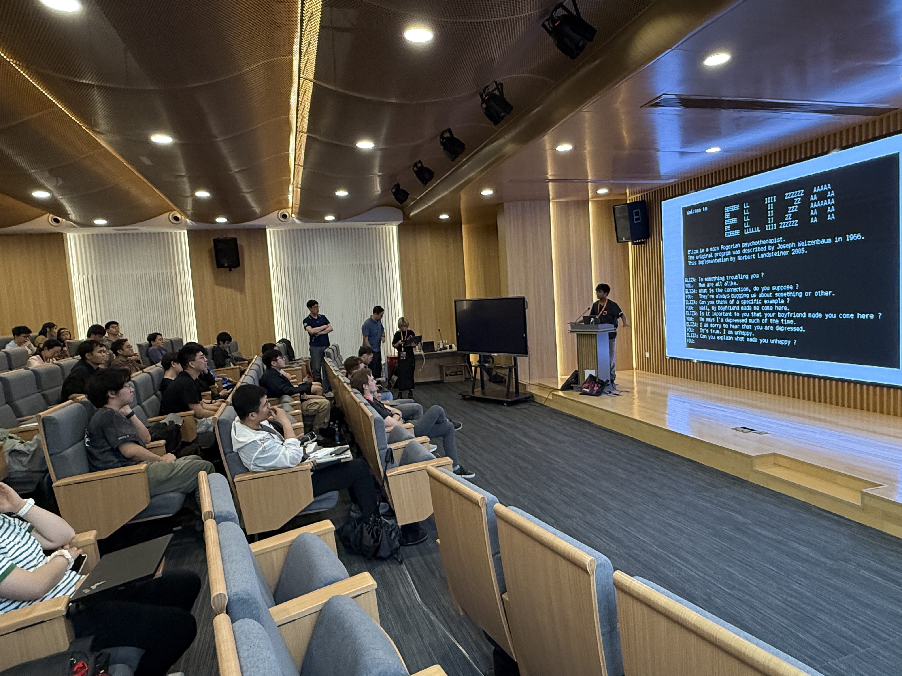

如果你是一名开发者，想必你使用过 **CLion/GoLand/IntelliJ IDEA**/… 等 IDE；如果你是一名设计师，或许你使用过 **JetBrains Mono** 来进行平面设计；又或者，你可能在计算概论 C 课程中听过 **PyCharm** 的简洁易用。以上这些产品均来自 **JetBrains** 公司。JetBrains是一家国际领先的软件技术开发公司，其最为出名的产品便是其创新和高质量的集成开发环境(IDE)系列，减轻配置开发环境的痛苦，助力开发者高效安全地开发程序；除此之外， JetBrains 公司还推出了开源的 **Kotlin 编程语言**，改善了 Java 开发体验并成为 Android 的官方推荐语言……

本次活动，北京大学学生 Linux 俱乐部邀请到了 JetBrains 公司软件工程师与 Kotlin 编程语言专家，为大家分享 JetBrains 系列 IDE 的使用技巧、 Kotlin 编程语言的内部设计与 JetBrains 系列 IDE 中的 AI 特性(部分讲座为英文分享，现场配有中文转译)。

如果你正在使用 JetBrains 系列 IDE，或是希望了解 JetBrains IDE 有哪些助力开发的小技巧，欢迎[填写问卷报名参与本次活动](https://f.kdocs.cn/g/1FamYIOR?channel=vampa1)，现场还有来自 JetBrains 的精美周边发放。

- 时间: 2025年10月11日 13:30-17:30 (CST)
- 地点: 北京大学二教202 (暂定)
- 线上直播: https://live.lcpu.dev

活动开始前(11:00-13:00)，我们将会在新太阳北侧马路准备互动展位，欢迎大家前来参与小游戏领取周边，讲座现场也将有周边发放！

## 讲座安排

### JetBrains IDE 实战技巧与 Git 高效版本管理

14:00–15:00

在现代软件开发中，高效开发不仅依赖于顺手的 IDE 使用技巧，也包括稳定流畅的版本管理工作流。JetBrains 出品的 IDE（如 IntelliJ IDEA、PyCharm）凭借统一操作体验、智能补全与强大的插件生态，已成为许多开发者的效率利器。而 Git 作为业界标准的版本控制系统，更是团队协作和代码管理的基石。这场轻松实用的演讲，将分享数个最常用、也容易上手的 IDE 使用技巧，并带你迅速掌握 Git 的关键命令与常见使用场景，轻松告别“误删代码”的焦虑。无论你是刚入门的新手，还是想解锁更多 Git 功能的进阶用户，这场分享都能让你少走弯路，学完立刻就能应用到自己的项目中，开发效率立马提升！

**主讲人: Jan Kleprlik 软件工程师**

### 为何开发者钟爱 Kotlin!

15:10–16:10

JetBrains 不仅打造了 IntelliJ IDEA、PyCharm 等知名 IDE，也自主研发了如今炙手可热的编程语言 Kotlin。Kotlin 已成为现代软件开发中的热门选择，尤其受到 Android 开发者的青睐。在本次演讲中，你将有机会与 JetBrains 的 Kotlin 专家一同深入探讨编程语言设计、多平台开发与开发工具生态。我们将分享多个 Kotlin 核心特性的设计思路，帮助你理解语言设计在真实工程中的权衡与考量，以及 Kotlin 的未来发展。

**主讲人：Wout Werkman 软件工程师及Kotlin专家**

### JetBrains IDEs 的 AI 演进与实践

16:20-17:00

人工智能已是全网关注的科技焦点。无论你是否为开发者，都能感受到它将深远影响人类未来数个世纪的发展。在本场分享中，我们将从 AI 的基本概念切入，同步介绍 JetBrains IDE 如何在 AI 浪潮下不断演进，打造更智能的开发辅助体验。无论你是刚踏入 AI 领域的新手，还是渴望探索智能体潜力的开发者，这场新手友好的分享都将为你带来启发与方向。

**主讲人： Jan Kleprlik 软件工程师**

### JetBrains 校园大使实习项目介绍

17:10-17:30

想拓展你的技术影响力吗？ JetBrains 校园大使项目即将推出，并邀请曾任大使的伙伴现身说法，分享他们的成长故事与参与心得。透过这些真实经验，你将看见这个计划如何帮助学生走向更广阔的技术舞台。欢迎加入这个激发潜力、连结全球开发者的旅程！

**主讲人： Tatiana Mironova/刘辰皆 JetBrains高校关系与合作部**

## 讲师介绍

- **Jan Kleprlik**

  Jan 是一位编译器与优化爱好者，现于 Kotlin 多平台工具链的研发团队担任软件工程师。Jan 主要专注于 Swift 编程语言的性能优化与相关工具开发。他的职业旅程始于 3 年前的一次实习，当时他就开始接触 Swift，并致力于提升 Apple 开发者的开发体验，同时也培养了自己对编程语言的热情。Jan 还经常积极组织和参与各类校园技术推广交流活动。

- **Wout Werkman**

  Wout 是 JetBrains软件工程师，他热衷于软件工程，特别专注于编程语言与库的设计。作为开发者，他主要从事 Kotlin 工具链的开发，尤其是面向 Compose 开发者的相关工具。Wout 起初是以实习生身份加入 JetBrains，后来成长为全职开发者，并进一步拓展为技术布道师，将他的热情分享给广大的技术社区。

- **Tatiana Mironova**

  Tanya是 JetBrains 全球高校关系与发展部门的负责人，她已经在JetBrains工作近11年，热衷于 JetBrains 的教育支持及研究工作，并拥有丰富经验。她一直带领团队支持众多世界各地优秀高校的学生通过 JetBrains 进行编程学习与实践。2025年，Tanya 在 JetBrains 中国团队的协助下发起与更多中国高校师生交流及校园技术推广活动。

- **刘辰皆**

  刘辰皆是 JetBrains 教育项目中国区负责人，在培训管理及产品市场推广具有浓厚兴趣，并始终致力于 JetBrains 为中国高校提供有效的教学支持与持续推动 JetBrains 教育方案在中国教育市场的落地及改进，让同学们在编程工具学习中更轻松上手，更便利使用。

文案: JetBrains 霍子晗

排版: 霍子晗

问卷: 霍子晗

图片: JetBrains

审阅: 刘浩槟 邢朕玮 戴嘉震 黄熙鸣

感谢 JetBrains 公司为本次活动提供周边支持。

