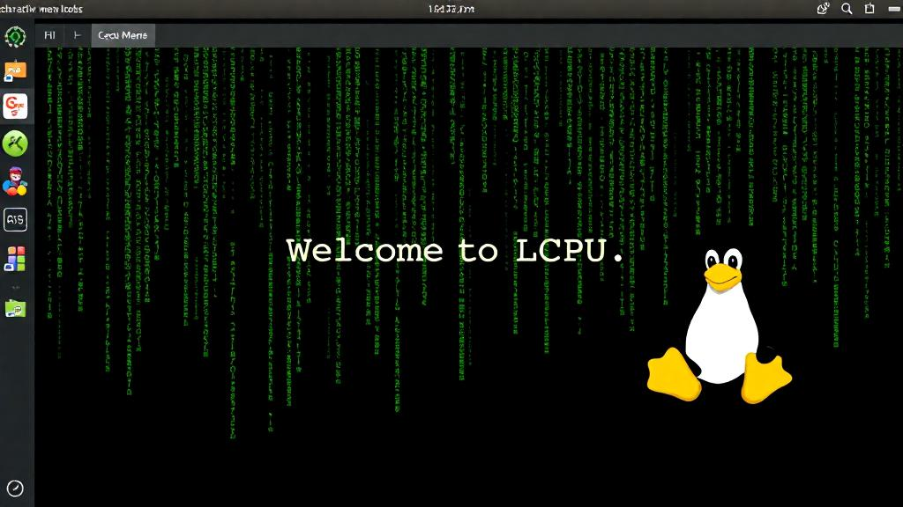

作为一名 LCPUer ，你是否想要了解俱乐部的日常活动与开发项目，是否期待在你的 Intel / AMD / ~~🍎 /~~ 树莓派 / 龙芯 / ... 设备上运行装机数量最多的 Linux 操作系统？

北京大学学生 Linux 俱乐部将于本周六下午在极客实验室举办本学期的迎新会，活动现场社团骨干成员将介绍 LCPU 目前所维护的基础设施与开源项目，并分享 Linux 发行版知识与自己的使用经验。骨干成员还将手把手带领你在自己的设备上安装 Linux 操作系统，以便成为一名合格的小企鹅！同时，也非常欢迎新朋友能够在现场为大家分享自己的 Linux 使用经验或开源项目参与经历。

- **时间**: 2025年3月15日(星期六) 15:00-17:00 (CST)
- **地点**: 北京大学二教地下极客实验室
- **报名问卷**: [https://s.lcpu.dev/2025-spring-install-party-form](https://s.lcpu.dev/2025-spring-install-party-form)
  

## 活动流程

### 迎新会

俱乐部骨干成员将首先为大家介绍 Linux 俱乐部的主要活动及开发项目(文末附有项目一览)，欢迎大家畅所欲言，分享自己的想法及灵感。

同时，为了帮助大家快速熟悉彼此，俱乐部成员将带领大家使用 Git 完成一次“开源贡献”并以代码的形式进行自我介绍。

```ini
[about]
name = Tux
avatar = ./tux.png
hobbies = eat, sleep
skills = c, rust, php

[social]
github = tux
website = https://en.wikipedia.org/wiki/Tux_(mascot)
```

::: info
可在 <https://missing.lcpu.dev/basic/06-drive-your-computer-2> 了解 Git 的基本原理及使用方法。
:::

### Install Party

::: info
由于时间关系，社团无法在短时间内详细讲述 Linux，推荐感兴趣的同学阅读友社**中国科学技术大学 Linux 用户协会**编撰的 [Linux 101 系列文档](https://101.lug.ustc.edu.cn/) 。
:::

俱乐部骨干成员将为大家简要介绍 Linux 内核与 Linux 的各大发行版。我们会尽可能以简单的形式帮助大家理解 Linux 操作系统的核心理念，并带领大家在自己的设备上安装 Linux 操作系统。

尽管我们希望大家都能以 Linux 作为主要操作系统，如果你暂时不想抛弃 Windows / macOS 等操作系统，也可以通过:

- 虚拟机使用 Linux

  请提前安装 VirtualBox 或登陆 [CLab](https://clab.pku.edu.cn) 创建虚拟机。
- 双系统

  我们推荐使用第二块硬盘以安装 Linux 操作系统。如要通过硬盘分区安装，可提前关闭 BitLocker/FileVault 等硬盘加密服务

我们将在现场提供 PXE 网络启动服务及 Linux 安装 U 盘，同时骨干将随时在现场为你提供手把手指导！

希望能与大家度过一个美好且有意义的下午！

## 参考内容

### LCPU 项目组

- **Loong Arch Linux**: Arch Linux for Loong64（或Loong Arch Linux）是专为龙芯自主研发的龙架构（LoongArch）打造的Arch Linux移植版本，目前由北京大学学生Linux俱乐部（LCPU）全面维护，致力于为国产硬件提供简洁、高效、强大的滚动更新系统。我们以“上游优先”为核心，遵从“KISS”原则，推动龙芯生态与国际开源社区接轨，让国产芯片用户也能体验原生Arch Linux的灵活性与前沿技术。
- **CLab 云计算平台**: 全国首个由高校社团自主打造的云计算平台。基于 OpenStack 混合 AMD/Intel 多架构，助力全校科研教学工作。在这里可以在真实生产环境中发挥你的 Linux 知识并创造出更大价值。
- **PKUTeX 论文协作平台**: PKUTeX 是 LCPU 基于 Overleaf 开源项目打造的论文在线协作平台。我们会根据上游更新移植企业版功能并加入中文本地化支持。
- **LCPU Getting Started**: Getting Started课程旨在为全水平段同学提供简介完备的计算机使用教程，补齐学校对计算机基础教育的缺失，帮助大家更高效利用计算机完成项目。
- **北京大学开源镜像站**: 作为 Tuna 的补充，服务华北地区的开源软件镜像站。采用全闪存架构，你可以发挥你的存储网络调优技术让镜像站更高效地服务同学。
- **PKUGit**: 安全、可靠、高性能的代码托管与自动构建平台。
- **PKUInfo**: 大模型自动汇总校内资讯，不再错过任何一条校内外信息。
- **运维组**: 管理 Linux 俱乐部的基础设施。
- **外联部**: 与计算机领域头部企业合作交流、对接课程需求。
- **活动组**: 组织社员参与开发挑战、外出团建、年会等活动。
- **开发组**: 在这里施展你的代码才华，编写出造福世界的开源软件。

`d2lmaTovLzoyMDI1aW5zdGFsbFBhcnR5QGxjcHUtY2x1Yg==`