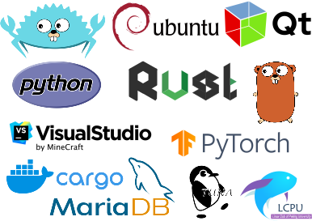
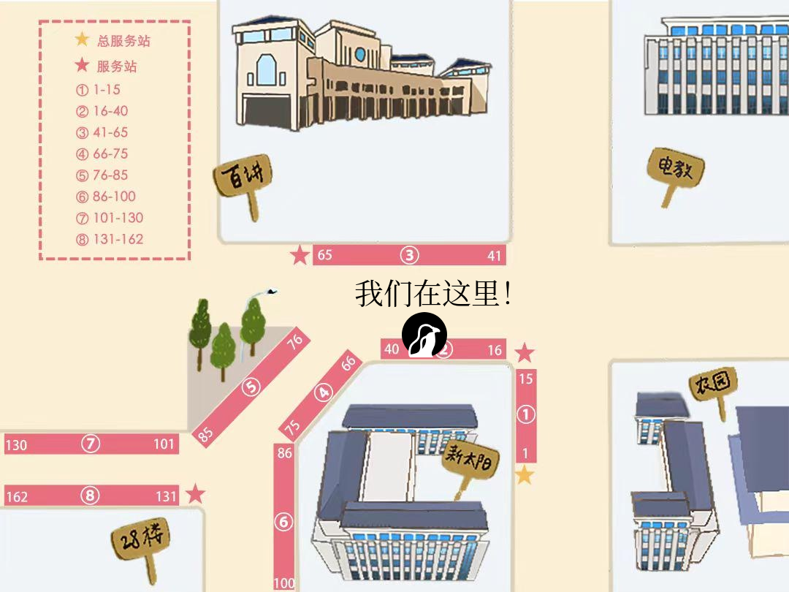

🐧 你想了解驱动全球上亿设备的 Linux 操作系统与开源技术吗？

✅ 你想参与高水平技术项目，与国内外大厂及开源社区交流合作吗？

🖥️ 你想助力**真**·满血版 DeepSeek 上线北京大学吗？

那就加入 LCPU，和我们一起用代码创造未来吧！🎉

## whoami

**北京大学学生 Linux 俱乐部** (Linux Club of Peking University, 简称 **LCPU**) 成立于 2003 年，是北京大学最活跃的学术科创类社团之一。我们致力于学习和研究 Linux 操作系统及其他开源软硬件技术，并通过多个高质量项目和活动推动开源精神的发展。

### [CLab 云计算平台](https://clab.pku.edu.cn)

CLab 是由社团打造的开放云计算平台项目，深度适配校内课程，为同学们提供了开箱即用的编程环境，方便大家快速上手开始学习。目前已经为 15+ 课程提供了教学环境支持，服务全校43个单位超1000名用户，为同学们减少了不必要的学习负担。

除此之外，我们还有 **[Arch Linux 龙芯移植](https://www.loongbbs.cn/d/156-%E6%96%B0-loong-arch-linux-%E9%A1%B9%E7%9B%AE%E5%8F%91%E5%B8%83%E5%85%AC%E5%91%8A)**、**[PKUTeX论文协作](https://latex.pku.edu.cn)**、**[PKUInfo校园信息整合](https://pkuinfo.lcpu.dev/)**等多个项目持续开发维护；**Rust 学习小组**、**Getting Started 课程**欢迎你的加入；以及**发行版之夜**、**GTK沙龙**等线下沙龙活动。
  

## 现场活动

### DeepSeek R1 671B 满血版体验

**LCPU AMD × DeepSeek 小组** 近期完成了 DeepSeek 模型优化，并成功在社团服务器上全速运行！在百团活动现场，你可以亲自体验 **DeepSeek R1 671B** 的强大能力，感受最前沿的 AI 推理速度与性能！

### LCPU 纪念贴纸

作为程序员，怎么能没有一套酷炫贴纸点缀你的笔记本/键盘/服务器呢？关注本公众号即可在现场领取由 LCPU 倾情打造，融合程序员文化、Linux 精神和开源技术的贴纸一份！

### 答题挑战赢纪念品

本学期，LCPU 将继续沿用 AI 问卷自动招新模式。但本学期如果你能取到 90 分以上的成绩，将可兑换 LCPU 纪念品一份(先到先得)，快来参与答题检测你的技术水平吧！

## 加入我们

欢迎扫描[完成问卷加入 LCPU](https://useradd.lcpu.dev) ，我们欢迎你的到来！如果你想要加入我们的工作小组，欢迎到现场咨询及关注后续推送！

## 活动信息

**时间**: 2月28日-3月1日 10:00-17:00

**地点**: 33号摊位(新太阳学生中心北侧)

