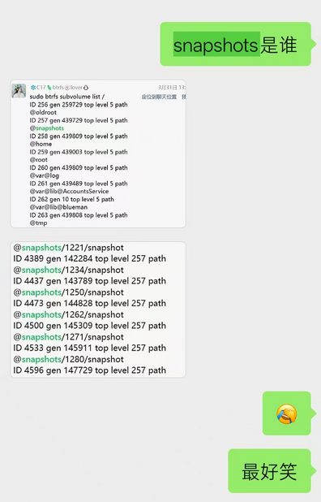
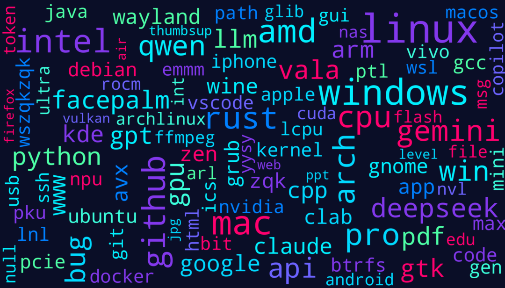
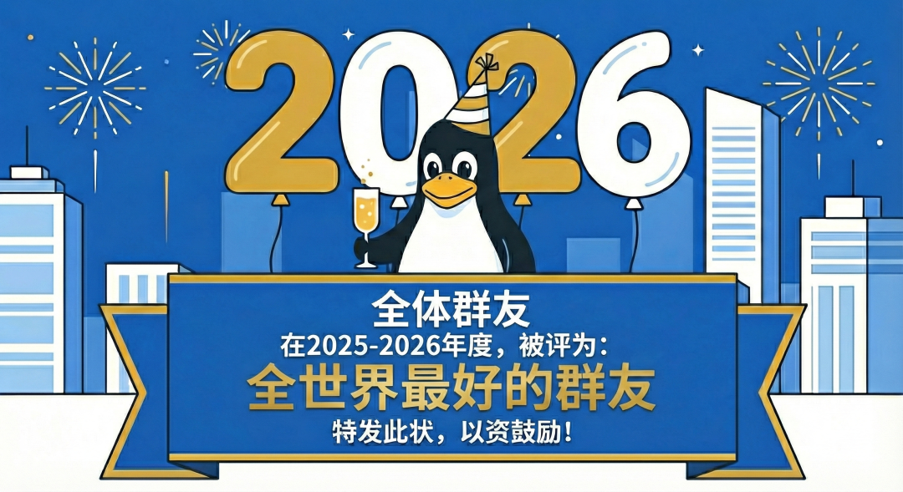

# 


祝各位同学 **2026 元旦快乐**！🎉

转眼间，LCPU 已经陪伴了大家22个年头，我们也共同度过了意义非凡的又一年。本篇推送是 Linux 俱乐部 2025 年度总结系列的第一篇 —— 微信群年度报告。

在2025 年度的社团群组中，我们有474位群友在里敲下了 **326,527** 条消息，总计 **4,868,397** 个字符。如果用这些文字发布一本 LCPU 年册，大概能绕未名湖好几圈（不是）。感谢各位社员的陪伴与支持，很高兴能够与大家拥有这样一片谈天说地、自由讨论、共同见证历史的小天地，祝我们在新的一年里继续成长，保持折腾新技术的激情，收获更为充实的生活！

首先，我们在此留下一个小 FLAG ，欢迎大家尝试解题，在破解谜题后联系 **Linux 俱乐部 #2026** 群主领取新年红包（限量前30，按发送谜底时间(已加好友)/加好友时间(请在申请好友消息中准确并只填写谜底)）！

`0d3b2d3d39112f3d2313312b291e2a26342a`  

 (Hint: K.I.S.S.)

现在，让我们一起来回顾一下 **Linux 俱乐部 #2025 🎆** 中魔幻而又充实的一年！

> 统计时段：2025.02.19 (新群建立) - 2025.12.31 (截至 2025-12-31 14:33:26 UTC+8)

## LCPU 年度风云人物

### 😋 年度话痨榜

| 排名 | 群友 | 发言条数 | 点评 |
|:---:|:---|:---:|:---|
| 🥇 | antercreeper | 56,069 | 群里的百科全书，从芯片架构聊到国际局势 |
| 🥈 | wszqkzqk | 49,715 | Vala + Arch首席布道师 |
| 🥉 | (不愿具名的群友) | 19,579 |    |
| 4 | ❄C17🦎btrfs🍥lover🐧 | 19,090 | Btrfs 死忠粉，Wayland 观察员 |
| 5 | 与OS共度良宵 | 16,315 | 职场导师 + 群内男女比例之谜 |
| 6 | OutisLi | 15,356 | 数码新品第一体验官 |
| 7 | djdjz7 | 14,795 | 前端~~苦手~~能手，Rust 学习中 |
| 8 | 陈炎 | 11,174 | 瑞典生活博主 + 深夜炼猪油选手 |
| 9 | Horbin | 9,389 | 跨专业求职辛酸代言人 |
| 10 | 无色方糖 | 8,333 | 古希腊掌管优惠券的神 |

### ✍️ 年度码字王

| 排名 | 群友 | 总字符数 | 平均每条消息字符数 |
|----|----|----|----|
| 🥇 | antercreeper | 779,036 | 13.9 |
| 🥈 | wszqkzqk | 599,579 | 12.1 |
| 🥉 | ❄C17🦎btrfs🍥lover🐧 | 347,989 | 18.2 |
| 4 | OutisLi | 280,173 | 18.2 |
| 5 | djdjz7 | 225,777 | 15.3 |

### 👀 年度表情包大师

| 表情包类型 | 冠军 | 数量 | 占总消息数 |
|:---|:---|:---:|:---:|
| 图片 | wszqkzqk | 3,816 张 | 7.68% |
| 表情包 | antercreeper | 2,423 个 | 4.32% |

根据以上数据，我们评选出 2025 年度 LCPU 最喜爱的表情包：

1. 🖐🏻️😭🖐🏻️ (使用次数: 230 次)

  

2. 😭😭😭 (使用次数: 217次)

  
  

3. 要给他迎头痛击 (使用次数: 120次)

    

4. 向将军\_\_ \_\_  (使用次数: 113次)

  


5. 🥹 (
使用次数: 103次)

  


### 🥵 年度热门 Emoji

| Emoji | 出现次数 |
|----|----|
| 😋 | 1694 |
| 😭 | 1510 |
| 😡 | 517 |
| 🐮 | 307 |
| 💩 | 260 |
| 🖐🏻️😭🖐🏻️ | 207 |
| 👀 | 197 |
| 😂 | 130 |
| 😭😭😭 | 125 |
| 👿 | 108 |

### 📢 年度最受欢迎榜

| 排名 | 群友 | 被 @ 次数 | 上榜原因 |
|:---:|:---|:---:|:---|
| 1 | wszqkzqk | 87 | Vala 传教 + 虫子图鉴 |
| 2 | 所有人 | 48 | 群公告/重要通知 |
| 3 | 可爱大笨蛋 | 37 | 北京大学计算机基础能力手册求助热线 |
| 4 | 孙远航 | 35 | CLab 运维呼叫 / 消息路由 |
| 5 | 陈炎 | 32 | 瑞典问题咨询处 |

彩蛋: 在初次统计中，我们发现被统计最多人中 @snapshots 赫然上榜，原因竟是：



<div style="display: none">ARCH</div>

## 💬说文解字 |  LCPU 年度热词

### 中文热词 TOP 20  


```
支持(2039)  手机(1690) 模型(1489) 内存(1368) 
喜欢(1211)  电脑(1168) 性能(1125) 代码(1059)
苹果(1050)  软件(994)  系统(951)  群友(916) 
数据(863)   小米(850)  编译(820)  便宜(811)  
服务器(805) 华为(794)  语言(787)  公司(785)
```

### 英文热词 TOP 20



```
linux(1986) windows(1520) mac(1300)    amd(1194)
intel(1162) github(1097)  rust(1054)   pro(1011)
cpu(997)    arch(936)     gemini(901)  qwen(849)
win(838)    api(794)      bug(747)     deepseek(731)
vala(683)   gpu(635)      python(623)  llm(611)
```

### 🏆 年度热词：DeepSeek

2025年1月，DeepSeek R1 正式发布，不仅群友们用上了物美价廉的 LLM API，大模型走入千家万户、千行百业，也走进了我们的工作和生活；2月开源周，FlashMLA、DeepEP、DeepGEMM 和 3FS 等开源框架先后发布，让 AI 行业巨震。作为开源社团，LCPU 敬佩不已；年末 V3.2 上线，API 价格低到第三方都没生存空间。

一整年，群友们从本地部署到 API 调用，从吐槽幻觉到赞叹性价比，DeepSeek 始终是出场率稳定最高的模型。

群友 antercreeper 不禁两次评价道：“我的每一块钱都是射向美利坚和 OpenAI 的子弹。”

### 其它年度关键词解读

* 💻 技术热词

   | 关键词 | 出现次数 | 群友怎么说 |
   |----|:---:|----|
   | **支持** | 2039 | gcc属于有支持但还没到能用的地步 |
   | **编译** | 820 | 32核机器编译ROCm要20小时+，xxx代码质量差 |
   | **内核** | 633 | Rust进入内核争议持续一整年，Linus都下场了 |
   | **开源** | 742 | 开源的大手发发力 |
   | **Wayland** | 415 | 不用的唯一理由是它还不完善 |
   | **btrfs** | 288 | 快照功能救了我误删的`/etc` |

* 🤖 AI 热词

   | 模型 | 出现次数 | 群友怎么说 |
   |----|:---:|----|
   | **Gemini** | 901 | 3.0一步拉满，就是幻觉变严重了 |
   | **Qwen** | 849 | 小参数本地部署最佳选择 |
   | **DeepSeek** | 731 | 每一块钱都是射向OpenAI的子弹 |
   | **GPT** | 594 | 5代薛定谔式发布，搞不懂OpenAI在干嘛 |
   | **Claude** | 468 | 写代码是真的强，就是容易封号 |
   | **LLM** | 611 | 2025年不会用LLM等于不会用搜索引擎 |

* 🔥 生活热词

   | 关键词 | 出现次数 | 背后的故事 |
   |----|:---:|----|
   | **群友** | 916 | 互相@、互相帮助、互相伤害 |
   | **便宜** | 811 | "便宜没好货"——扩容SD卡受害者 |
   | **逆天** | 520 | 最常用于形容课程作业和硬件价格 |
   | **抽象** | 470 | 本群第二官方语言 |

## 🗣️ 年度金句

> "我的每一块钱都是射向美利坚和 OpenAI 的子弹 🥵" — antercreeper，评 DeepSeek API 定价

> "我之前真的没遇到过用户态程序能给物理机整爆炸的" —  孙远航，评 sglang 导致 PCIe Fatal Error

> "不用 Wayland 的唯一理由只是 Wayland 不完善罢了" — antercreeper

> "校招生经典误区: 技术越难越好 / 实则并不 / 需求越大 供给越少 才有高价可能" — 与OS共度良宵

## 🎭 年度名场面回顾

### 🦠 勺园生物多样性保护区

wszqkzqk 同学的宿舍在2025年荣升为勺园生物志采样点，先后出现了：

-   隐翅虫（差点拍脖子上）
    
-   剑角蝗
    
-   瓢虫
    
-   壁虎
    
-   以及各种不明昆虫
    

### 💰 900刀域名大冤种

陈炎同学为了注册 `rui.ke` 这个域名：

-   从 2299 刀砍价到 900 刀
    
-   经历非洲银行汇款龟速
    
-   注册局放假
    
-   域名显示不可用的惊魂时刻
    

最终成功拿下，群友封其为"瑞客"。

### 🎣 计算中心钓鱼执法

学校计算中心的钓鱼演练越来越逼真，甚至私人定制链接。但群友们的反应是："我是小馋猫，明知是钓鱼我也要点进去看看"

### 🎮 LeetCode 钓鱼执法

LeetCode 在题目中隐藏了人眼不可见的文字，要求使用特定变量名。复制给 AI 后，AI 会老老实实用这个变量名，从而被判定为作弊。

群友评价："天才设计，AI 审判 AI"

### 🔓 Next.js 安全漏洞血案

12月，Next.js 爆出严重安全漏洞（CVE-2025-55182），多位群友自建的 LobeChat 等服务惨遭攻击。

群友**看到我请@我并让我滚去学习在吐槽**： "我是React，我家Next.js快熬不下去了……它弱得发日志说'妈，顶不住了'"

**Horbin** 感叹"裸奔"风险太大，**我爱中国** 吐槽 Next.js 默认开启 RSC 增加了安全隐患。

在这里，LCPU 提醒大家: 自建服务记得及时更新，Docker 也不能保证安全无虞。

## 🤡 年度迷因

-   **语言神**：Rust 的尊称，安全但 unwrap()
    
-   **安卓电脑**：xxx二元分类法，万物皆可安卓/苹果
    
-   **疯狂星期四 V 我 50**：每周四的固定节目
    
-   **将军、Phyton**：没有解释的义务
    

### 🕔 年度活跃时段

根据统计，群友们最喜欢在18点聊天，总计贡献了 26087 条消息。

-   晚上(18-24): 133796条 (40.3%)
    
-   下午(12-18): 127145条 (38.3%)
    
-   上午(6-12): 52327条 (15.8%)
    
-   凌晨(0-6): 18530条 (5.6%)
    

同时，群友们最喜欢在工作日摸鱼水群，共发出高达252533条消息，占总消息数量的 76.1%。

## 📈 年度理财产品：内存条及SSD

2025年，LCPU群友们见证了一场史诗级的存储涨价潮，从年初 DDR5 32G 只要 600元，到年末需要 1800元，涨幅超过 300%。群友锐评：

> "我的内存条比我的股票涨得还猛"
> 
> "早知道年初多囤几条，现在能换台显卡"
> 
> "HBM抢产能，消费级遭殃，这就是AI时代的代价"

**李炜恒** 甚至表示想把手里的内存卖了换钱，**LSY** 则晒出年初低价入手的大容量SSD表示"报复性消费"赢麻了。下次有群友说"现在买内存不亏"，请认真考虑。

LCPU 运维组曾多次打算把手上的内存全部出售待低价再进行回购

## 🎯 2026 Flag

基于群聊数据分析，我们大胆预测2026年：

1.  **Wayland** 终于能用了  
    那么 Linux 桌面年将会是哪一年呢？
    
2.  **Rust** 入核争议将持续  
    Rust 虽好，也不能 Unsafe 乱飞哦
    
3.  **DeepSeek** 会继续卷死一众友商  
    Loongarch 64 也要加油
    
4.  wszqkzqk 会继续安利 **Vala**  
    乌拉！~
    
5.  内存价格会继续让人血压升高  
    已经实现了，不仅内存疯涨，显卡也涨价了
    
6.  群友们依然会在深夜讨论人生  
    祝大家早日收获幸福美满爱情
    

在此，感谢每一位在群里热心分享知识、积极解答问题、贡献新的小猫表情包、以及带来最新最有趣的梗的群友！是你们让这个群成为了我们讨论技术问题优秀社群、测评数码新品的潮流风向标、倾诉职场焦虑的安全屋、深夜emo的避风港以及无数欢乐的源泉！希望我们在新的一年继续分享快乐与喜悦，继续为社团日志贡献精彩瞬间！



Nano Banana Pro 生成

`echo "Happy New Year 2026!" >> /dev/tty` 🎊

##