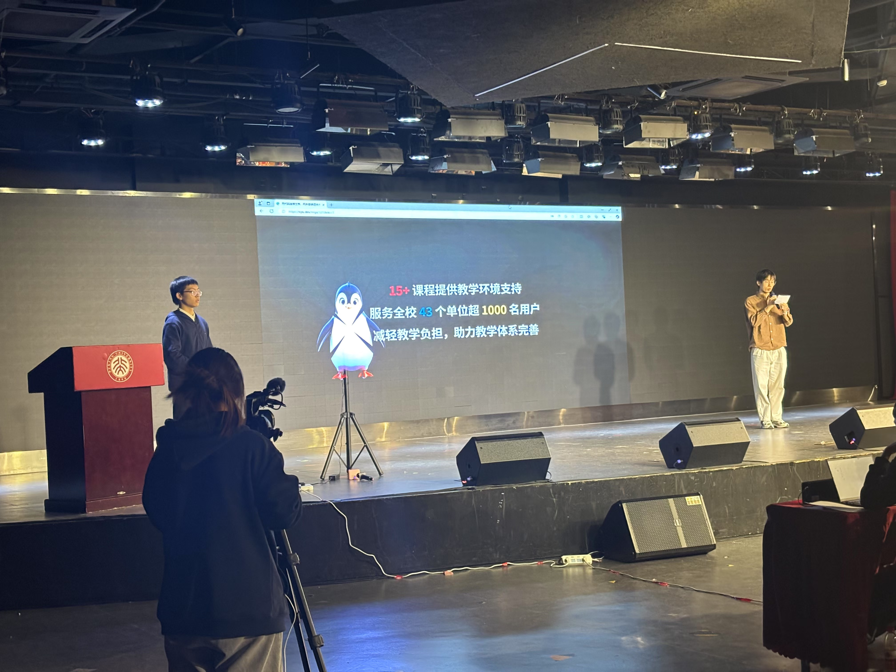
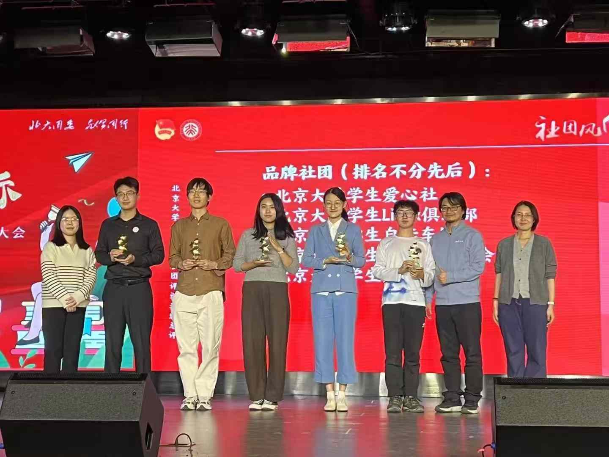

2024 年 12 月 10 日晚，2023 - 2024 学年度“社团风向标”北京大学优秀学生社团评优表彰大会在新太阳学生中心举行。经过学生社团申报、初评、复评等多轮环节，北京大学学生 Linux 俱乐部成功入选学生社团评优表彰总评环节，并从中脱颖而出，斩获 2023-2024 学年度北京大学“品牌社团”称号，这也是北京大学学生社团的最高荣誉。

在本次“社团风向标”评优表彰大会上，北京大学学生 Linux 俱乐部社长霍子晗同学、社团骨干黄熙鸣同学以及社团吉祥物“小企鹅”为大家带来了一场别开生面的 LCPU 体验之旅。

从服务全校师生学习生活的 PKUINFO、PKUTeX、PKU Clab 等技术项目，到回馈开源社区，主动参与国产软硬件开源社区建设；从举行面向全校同学普及计算机基础知识的 Getting Started 课程，到每年吸引全球高手同台竞技的 HPCGame、GeekGame 两大赛事，LCPU 作为北大最活跃的学术科创类社团之一，给出了自己独特的解决方案，也凸显着作为北大学生社团对于校园与社会的责任与担当。

衷心感谢所有在社团答辩准备期间精益求精连夜讨论筹备的社团骨干们，感谢所有同学对于社团日常活动与项目的支持与参与！当然，也同样感谢学校和信息科学技术学院对于社团发展的大力支持，感谢社团指导老师杨延军老师对于社团活动的参与和指导！

时光流转，本月也将迎来 LCPU 的二十一岁生日。我们当然经历过每周一次沙龙的热烈、但也同样经历过成员寥寥的冷清。是热爱 Linux、热爱技术、热爱开源的初心让我们一次次重聚，用一行行代码亲手描摹美好未来的蓝图，携手向前。我们相信，在未来，LCPU 仍然能够展现其独有的创造力和活力，志同道合的同学们能够在社团相遇相识相知，共同创造出更广阔的天地。

永远期待美好的事情正在发生！
